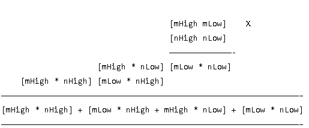

#16 bit Wallace tree multiplier in VHDL
This contains the Wallace tree 8 bit and 16 bit multiplier.  
I used four of 8 bit multiplier to make a 16 bit multiplier using the algortihm in the image below.  
  
Where mLow and nLow are the 8 LSB of the 16 bit numbers, while mHigh and nHigh represent the 8 MSB.  
I made this multiplier with the purpose to improve the CNN calculation in term of speed and power consumption performance. 
